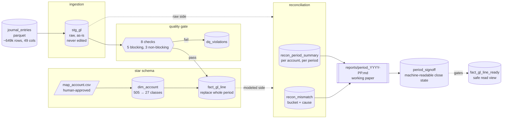

# finance-migration-batch

I built this batch pipeline to migrate a SAP-style general ledger extract
into a warehouse and explain the differences between source and output.
It uses Python and DuckDB, with SQL for reconciliation and Airflow for
orchestration.

The source has about 649,000 rows and 49 columns. Current close scope is
company `1000`, fiscal year 2024, periods 01-03. Reconciliation compares
raw staging with modeled data from the same extract; there is no separate
legacy-system baseline.

## Architecture



`stg_gl` keeps the source unchanged. The GL line grain is
`company_code + document_id + line_number + fiscal_year + fiscal_period`.
The pipeline applies a human-approved `map_account.csv` to build
`fact_gl_line` at the same grain. Roughly 505 source accounts map to about
27 classes, with clearing and catch-all codes retaining their own identity.
`dim_account` is built separately by the mapping bootstrap.

The quality gate has eight checks: five blocking and three non-blocking.
Blocking findings exclude affected lines from the fact table; all findings
go to `dq_violations`. Duplicate grains are blocked because the source has
no version field to identify which copy to keep.

Each fact load replaces the requested periods in one transaction. Regression
checks verify that rerunning with unchanged mapping preserves counts and
totals. `recon_period_summary` compares account totals; `recon_mismatch`
compares source lines with the close-eligible fact rows and assigns each
gap one bucket and one cause from [the definitions](docs/definitions.md).

The Airflow DAG runs seven pipeline stages followed by `period_close_gate`.
The final task checks the signoff row, three report files, account
reconciliation, and mismatch coverage. `max_active_runs=1` serializes runs
against the single DuckDB file. Tasks have one retry and require a shared
local filesystem. Each attempt records input hashes and results; retries
of source-reading tasks reject changed inputs.

See [architecture](docs/architecture.md) and
[design patterns](docs/design-patterns.md) for the design choices and their
references to Bartosz Konieczny's *Data Engineering Design Patterns*.

## Period close

Each period produces a [working paper](reports/period_2024-01.md), controller
pack, and exceptions report. `period_signoff` stores the machine-readable
close state ([ADR-0008](docs/adr/0008-markdown-report-is-working-paper-not-signoff.md)).
These are evidence for reviewing an extract, not an accounting-system sign-off.

<!--  -->


Reconciliation is accepted for P01-P03, but `local_amount` totals remain
unsigned because of issue [#13](../../issues/13). Matching source and target
does not establish that the source amount is correct. Document balance
validation uses `debit_amount - credit_amount`.

`fact_gl_line_ready` includes only periods with
`period_signoff.recon_status = 'accepted'` and flags whether `local_amount`
is safe to sum. See [query guidance](docs/how-to-query-fact_gl_line.md).

## Running it

### Local

With the source data in `dataset/`:

```bash
pip install -r requirements.txt
python3 src/load_stg.py
python3 src/load_fact.py 1000 2024 1 2 3
python3 src/reconcile_account.py
python3 src/reconcile_reversals.py
python3 src/reconcile_mismatch.py
python3 src/build_period_report.py 1000 2024 1
python3 src/build_period_report.py 1000 2024 2
python3 src/build_period_report.py 1000 2024 3
python3 src/build_analyst_view.py
python3 src/checks.py
```

The existing warehouse passes 81/81 checks. A fresh container run was
79/81: two checks require `dim_account`, which only
`src/build_mapping.py` creates. That bootstrap also overwrites
`map_account.csv`, so do not rerun it over an approved mapping. The normal
sequence above does not resolve this bootstrap gap.

### Docker

Use an existing DuckDB file at `warehouse_container.duckdb` for the file
mount below. If the host path is missing, Docker creates a directory and
DuckDB cannot open it as a database.

```bash
docker build -t finance-migration-batch .
docker run --rm -it \
  -v "$(pwd)/dataset:/app/dataset" \
  -v "$(pwd)/reports:/app/reports" \
  -v "$(pwd)/warehouse_container.duckdb:/app/data/warehouse.duckdb" \
  -e GL_WAREHOUSE_PATH=/app/data/warehouse.duckdb \
  finance-migration-batch
```

This opens a shell with the pipeline installed. Run the `python3` commands
above inside it. Data, reports, and the warehouse are mounted from the host.

### Airflow

Use an environment with Airflow, its SMTP provider, and DuckDB installed;
`requirements.txt` only installs DuckDB. Point Airflow's `dags_folder` at
this repo's `dags/` directory and configure `smtp_default` for failure alerts
as described in the [runbook](docs/runbook.md).

```bash
export PATH="$(pwd)/.venv/bin:$PATH"  # or wherever the Airflow venv lives
airflow standalone
```

The local UI is at `localhost:8080`; first launch prints an admin login.

<!--  -->

Trigger a period from the UI or CLI:

```bash
airflow dags trigger gl_period_close \
  --conf '{"company_code":1000,"fiscal_year":2024,"fiscal_period":3}'
```

The runbook covers setup, failure recovery, and executor requirements.

### Inspect the warehouse

With the DuckDB CLI installed:

```bash
duckdb -ui warehouse.duckdb
```

This opens the warehouse in DuckDB's web UI for browsing tables and running SQL.

<!--  -->

## Status

18 of 21 tracked missions closed. `src/checks.py` passes 81/81 checks against
the existing warehouse and isolated fixtures. Validated scope remains
company `1000`, FY2024 P01-P03.

[Mission 21](docs/missions/21-airflow-recovery-period-close-gate.md) added
the final close gate, per-attempt evidence, and failure alerts. A controlled
failure and recovery run against a warehouse copy reproduced the baseline
tables and reports.

Open issues:

- [#1](../../issues/1): rendered architecture diagram.
- [#11](../../issues/11): FY2025 P02 rows, pending expansion of close scope.
- [#13](../../issues/13): `local_amount` behavior on high-line-count documents.

A cloud warehouse migration and a declarative data-quality framework are
not implemented.

## Repo layout

```text
src/                  pipeline scripts and checks
dags/                 Airflow period-close DAG
tests/                CI fixture and checks
notebooks/            data exploration
reports/              period working papers, controller packs, exceptions
docs/architecture.md  architecture and pattern references
docs/definitions.md   grain, mappings, buckets, causes, guards
docs/runbook.md       setup, execution, recovery
docs/design-patterns.md  pattern choices and tradeoffs
docs/adr/             architecture decisions
docs/missions/        ticket specs and validation evidence
map_account.csv       human-approved account mapping
warehouse.duckdb      local warehouse, gitignored
```
