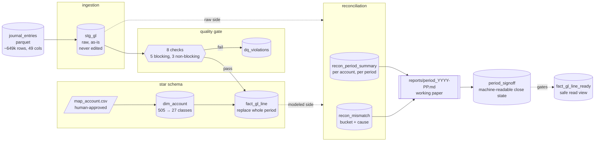

# finance-migration-batch

A finance team closing a period asks one question that a lot of pipelines
quietly dodge: does the number in the warehouse match the number in the
raw extract, and if it doesn't, why not, for every line. This project is
built to never dodge that question.

Raw SAP-style GL extract goes in, a modeled warehouse comes out, and every
period gets reconciled back against the source before anyone's allowed to
call it closed. It's not a dashboard and it's not a framework tour - I
don't care how the numbers look, I care whether they're right, and
whether I can say why when they're not.

## The problem, in one paragraph

A GL export lands as a flat file: 649,000 rows, 49 columns, one company,
thirteen months. Somebody has to turn that into something finance can
close a period against. Real chart-of-accounts mapping, checks for the
kind of thing a spreadsheet won't catch, and a line-by-line reconciliation
back to the raw extract. If a number moves between raw and published, this
project's job is to say exactly which line moved it and why. "Unknown" is
not an acceptable answer here, and the pipeline is built to make that hard
to fall back on.

## Architecture



Every arrow up there is a script in `src/`, and each one answers exactly
one question before it hands off to the next stage. I picked every
pattern name against Bartosz Konieczny's *Data Engineering Design
Patterns* on purpose, not as decoration after the fact. The full
breakdown of which pattern maps to which stage lives in
[`docs/architecture.md`](docs/architecture.md), if you want the citations.

As of `dags/gl_period_close.py`, those same seven scripts run as an
Airflow DAG instead of a hand-ordered shell sequence. Only one run at a
time (`max_active_runs=1`), because the warehouse is a single DuckDB
file with a single writer and two concurrent runs would just race each
other. That's the Single Runner pattern from the same book. Every task
gets one retry, which is safe here specifically because every task
replaces a whole period rather than appending to it - rerun it and you
get the same numbers back, not double the numbers.

The DAG's eighth and last task, `period_close_gate` (mission 21), is new
and not one of the seven pipeline scripts. It reads what the other seven
already produced - the signoff row, the three report artifacts, the
account reconciliation, the mismatch coverage - and decides whether the
requested period is genuinely closeable. A green DAG Run means something
now, not just that seven scripts happened to exit zero.

<!-- demo: Airflow's graph view for gl_period_close, mid-run or after -->
<!--  -->

## Data modeling

Grain is `company_code + document_id + line_number + fiscal_year +
fiscal_period`, one row per GL line. `stg_gl` sits at that grain,
untouched, exactly as it arrived. `fact_gl_line` is the same grain after
three things happen to it.

First, mapping. `map_account.csv` rolls roughly 505 raw source account
codes up into about 27 target classes, and a human signs off on that
file before it's used. Nothing in this pipeline guesses a target account
code from the data - a handful of accounts (clearing, catch-all) keep
their own code instead of rolling up, and `docs/definitions.md` says
exactly which ones and why.

Second, the quality gate. Eight checks, five blocking and three not.
A blocking finding keeps the line out of `fact_gl_line` entirely; a
non-blocking one still lets the line through but writes the problem to
`dq_violations` so it's visible instead of quietly swallowed.

Third, period replace. Loading a period deletes and reinserts the whole
thing inside one transaction, never an append. I didn't just assume that
was safe to retry - I reran it with an unchanged mapping and checked the
row counts and totals came back identical, and that check now runs as a
regression test.

Reconciliation runs `stg_gl` against `fact_gl_line` twice: once coarse
(`recon_period_summary`, totals per account per period) and once at the
line level (`recon_mismatch`, exactly one bucket and one cause per gap -
never two, because a mismatch with two causes is really two mismatches
that got lumped together). Every cause comes from a fixed list in
`docs/definitions.md`. Nothing gets invented on the fly inside a query.

`fact_gl_line_ready` sits on top of all of it, filtered down to periods
where `period_signoff.recon_status = 'accepted'`. The point of that view
is entirely defensive: it stops a downstream reader from accidentally
summing a period that was never actually checked.

## Running it

Two ways to run the same pipeline. They call the exact same functions in
`src/`, so pick whichever fits what you're trying to see.

**By hand**, following [`docs/runbook.md`](docs/runbook.md):

```bash
pip install -r requirements.txt
python3 src/load_stg.py
python3 src/load_fact.py 1000 2024 1 2 3
python3 src/reconcile_account.py
python3 src/reconcile_reversals.py
python3 src/reconcile_mismatch.py
python3 src/build_period_report.py 1000 2024 1
python3 src/build_analyst_view.py
python3 src/checks.py
```

**Through Airflow.** Start the local instance first - this bundles the
webserver, scheduler, triggerer, and dag-processor into one command,
which is convenient for a laptop and exactly the reason it's not what a
real deployment runs:

```bash
export PATH="$(pwd)/.venv/bin:$PATH"  # or wherever the Airflow venv lives
airflow standalone
```

It prints an admin login on first launch and serves the UI at
`localhost:8080`. You don't register `gl_period_close` anywhere - drop
the DAG file in `dags/` and Airflow's own dag-processor picks it up on
its next scan.

From there, trigger a run from the UI, or from the command line:

```bash
airflow dags trigger gl_period_close \
  --conf '{"company_code":1000,"fiscal_year":2024,"fiscal_period":3}'
```

## Looking at the data

```bash
duckdb -ui warehouse.duckdb
```

That opens DuckDB's own web UI against the real warehouse file. Every
table's browsable, column diagnostics are one click away, and there's a
SQL notebook for anything deeper. No separate database client, and no
version-mismatch risk either, since it's literally the same DuckDB build
that wrote the file in the first place - I burned an afternoon on a
third-party driver that wasn't, so this is the one I'd actually recommend.

<!-- demo: DuckDB UI with the warehouse's tables open -->
<!--  -->

## What "closed" actually means here

A period isn't closed because a script exited zero. It's closed once
[`reports/period_2024-01.md`](reports/period_2024-01.md) exists (the
working paper a human actually reads) and `period_signoff` carries that
period's machine-readable state. Those are deliberately two different
things - one file trying to be both a report and an approval record
tends to end up being neither convincingly. The report says so plainly
in its own text: it's evidence, not a signature. Full reasoning is in
[ADR-0008](docs/adr/0008-markdown-report-is-working-paper-not-signoff.md).

<!-- demo: a signed period report, or the controller pack -->
<!--  -->

## Status

18 of 21 tracked missions closed. `src/checks.py` runs 81 checks against
the real dataset and isolated fixtures, every real-data one pinned to a
real number rather than a placeholder, and right now it's 81 for 81.
Real scope today is company `1000`, fiscal year 2024, periods 01
through 03 - I haven't tried to pretend this covers more than it does.

Mission 21 closed out the Airflow DAG's remaining gaps: a real
period-close gate as the last task (not just seven scripts exiting
zero), per-attempt run evidence with source/mapping version hashing, a
failure alert that actually delivers, and a controlled-failure recovery
proven against a real copy of the warehouse, not simulated - see
[`docs/missions/21-airflow-recovery-period-close-gate.md`](docs/missions/21-airflow-recovery-period-close-gate.md).

Open on purpose, not forgotten:

- [#1](../../issues/1) - a rendered architecture diagram beyond the
  mermaid one above
- [#11](../../issues/11) - FY2025 P02 has some stray rows, out of scope
  until FY2025 actually opens
- [#13](../../issues/13) - `local_amount` behavior on high-line-count
  documents, still under investigation

And a few things I'm deliberately not building yet, named here instead of
left silent: swapping DuckDB for a cloud warehouse like Databricks or
Synapse (same SQL, different engine underneath), and a declarative
data-quality framework instead of the hand-written checks. Neither is
blocked on anything. They're just not needed yet at the scale this
project actually runs at.

## Tech

DuckDB, Python, Apache Airflow. Pandas-free by design - SQL does the
reconciling, not a dataframe. [`docs/design-patterns.md`](docs/design-patterns.md)
has the reasoning if you're wondering whether that was an oversight. It
wasn't.

## Repo layout

```text
.
├── src/                  pipeline scripts, one stage each
├── dags/                 gl_period_close.py - the Airflow DAG
├── tests/                CI fixture + its own check suite
├── reports/              signed period reports (real, committed)
├── docs/
│   ├── missions/         one spec per ticket, written before the code
│   ├── adr/              architecture decisions, with what was rejected and why
│   ├── architecture.md   full diagram + pattern citations
│   ├── definitions.md    every term pinned: grain, buckets, causes, guards
│   ├── design-patterns.md  which Konieczny patterns, and where this project differs
│   ├── runbook.md        run one period end to end, what breaks and what it means
│   └── images/           screenshots referenced above
├── map_account.csv       human-approved account mapping
└── warehouse.duckdb      gitignored - rebuilt by the loaders, not committed
```

Work here is tracked as GitHub issues, with blocked-by edges enforcing
dependency order. Every ticket gets a mission spec in `docs/missions/`
written before any code, real exploration against real data before a
rule gets locked in, and a human sign-off before the result gets used
for anything.
