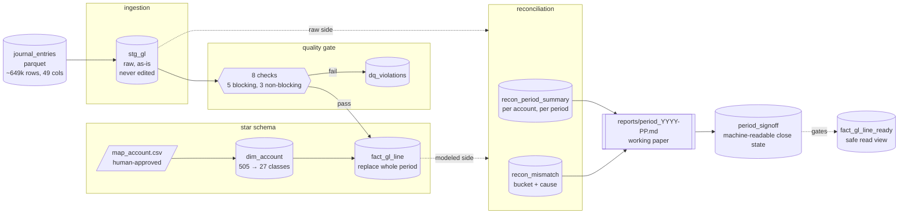

# finance-migration-batch

An ERP/SAP-style GL migration and reconciliation pipeline. It moves a raw
general ledger extract into a modeled warehouse, and for every period,
answers one question precisely: does the raw data match the modeled data,
and if not, why not, for every single line.

Not a dashboard. Not a demo of a framework. The whole project exists to
make one claim defensible: a finance period can close only when every
difference between what came in and what got published has a named cause.

## The problem, in one paragraph

A company's GL export arrives as a flat file: 649,000 rows, 49 columns,
one company, thirteen months. Someone has to turn that into a warehouse
finance can actually close a period against - mapped to a real chart of
accounts, checked for the kind of errors a spreadsheet won't catch, and
reconciled line by line against the raw extract. If a number moves
between "raw" and "published," this project's job is to say exactly
which line moved it and why, not to shrug and call it `unknown`.

## Architecture



Every arrow is a script in `src/`, and every one of them answers exactly
one question before handing off to the next. Full breakdown, including
which design pattern each stage follows (cited against Bartosz
Konieczny's *Data Engineering Design Patterns*, not just named), is in
[`docs/architecture.md`](docs/architecture.md).

**Orchestration:** as of `dags/gl_period_close.py`, the same seven scripts
run as an Airflow DAG instead of a manually-ordered sequence. Concurrency
is capped at one run at a time (`max_active_runs=1`) because the
warehouse is a single DuckDB file with one writer, not several - cited to
the *Single Runner* pattern from the same book. Every task carries one
retry, since every one of them is provably idempotent (replace-whole-
period, never append).

<!-- demo: Airflow's graph view for gl_period_close, mid-run or after -->
<!--  -->

## Data modeling

The grain is `company_code + document_id + line_number + fiscal_year +
fiscal_period` - one row per GL line. `stg_gl` is that grain, untouched.
`fact_gl_line` is the same grain after three things happen to it:

- **Mapping.** `map_account.csv` rolls 505 raw source account codes up
  into roughly 27 target classes. A human approves this file; nothing
  here guesses a target account code from data alone. A few accounts
  (clearing, catch-all) keep their own code instead of rolling into a
  class - see [`docs/definitions.md`](docs/definitions.md) for exactly
  which and why.
- **Quality gate.** Eight checks, five blocking and three non-blocking,
  run before a line is allowed to publish. A blocking finding excludes
  the line; a non-blocking one loads the line anyway and logs the
  problem in `dq_violations` instead of hiding it.
- **Period replace, never append.** Loading a period deletes and
  reinserts that whole period inside one transaction. Re-running with an
  unchanged mapping reproduces the exact same row counts and totals -
  proven as a regression check, not assumed.

Reconciliation compares `stg_gl` against `fact_gl_line`, twice: once
coarse (`recon_period_summary`, totals per account per period) and once
line-by-line (`recon_mismatch`, one bucket and one cause per gap, never
two). Every cause comes from a fixed list in `docs/definitions.md` - none
gets invented in a query.

`fact_gl_line_ready` is a narrower view on top of all this, filtered to
periods where `period_signoff.recon_status = 'accepted'`. It exists so a
downstream reader can't accidentally sum a period that was never actually
checked.

## Running it

Two ways to run the same pipeline.

**By hand**, following [`docs/runbook.md`](docs/runbook.md):

```bash
pip install -r requirements.txt
python3 src/load_stg.py
python3 src/load_fact.py 1000 2024 1 2 3
python3 src/reconcile_account.py
python3 src/reconcile_reversals.py
python3 src/reconcile_mismatch.py
python3 src/build_period_report.py 1000 2024 1
python3 src/build_analyst_view.py
python3 src/checks.py
```

**Through Airflow**, once it's running locally:

```bash
airflow dags trigger gl_period_close \
  --conf '{"company_code":1000,"fiscal_year":2024,"fiscal_period":3}'
```

Both paths call the exact same functions in `src/`. The DAG doesn't
re-implement anything; it sequences what already existed.

## Looking at the data

```bash
duckdb -ui warehouse.duckdb
```

opens DuckDB's own web UI against the real warehouse - every table
browsable, column diagnostics on click, a SQL notebook for anything
deeper. No separate database client needed, and no version mismatch risk
either, since it's the same DuckDB build that wrote the file.

<!-- demo: DuckDB UI with the warehouse's tables open -->
<!--  -->

## What "closed" actually means here

A period isn't closed because a script exits 0. It's closed when
[`reports/period_2024-01.md`](reports/period_2024-01.md) exists (the
working paper a human reads) and `period_signoff` carries that period's
machine-readable state - deliberately two different things, not one file
wearing two hats. The report can never be mistaken for an approval; it
says so in its own text. See
[ADR-0008](docs/adr/0008-markdown-report-is-working-paper-not-signoff.md)
for the full reasoning.

<!-- demo: a signed period report, or the controller pack -->
<!--  -->

## Status

17 of 20 tracked tickets closed. `src/checks.py` runs 72 checks against
the real dataset, every one pinned to a real number, not a fixture -
currently 72/72. Real scope today: company `1000`, fiscal year 2024,
periods 01 through 03.

Open, on purpose:

- [#1](../../issues/1) - a rendered architecture diagram beyond the
  mermaid one above
- [#11](../../issues/11) - FY2025 P02 stray rows, out of scope until FY2025 opens
- [#13](../../issues/13) - `local_amount` on high-line-count documents, under investigation

Deliberately not built yet, and named as a decision rather than left
silent: a cloud warehouse swap (DuckDB to Databricks/Synapse - same SQL,
different engine), a declarative DQ framework replacing the hand-written
checks, and a general-purpose period gate for the Airflow DAG's own last
task. None of these are blocked; none are needed yet at this project's
real scale.

## Tech

DuckDB · Python · Apache Airflow · pandas-free by design (SQL is the
reconcile engine; see [`docs/design-patterns.md`](docs/design-patterns.md)
for why that's a deliberate constraint, not an oversight)

## Repo layout

```text
.
├── src/                  pipeline scripts, one stage each
├── dags/                 gl_period_close.py - the Airflow DAG
├── tests/                CI fixture + its own check suite
├── reports/              signed period reports (real, committed)
├── docs/
│   ├── missions/         one spec per ticket, written before the code
│   ├── adr/              architecture decisions, with what was rejected and why
│   ├── architecture.md   full diagram + pattern citations
│   ├── definitions.md    every term pinned: grain, buckets, causes, guards
│   ├── design-patterns.md  which Konieczny patterns, and where this project differs
│   ├── runbook.md        run one period end to end, what breaks and what it means
│   └── images/           screenshots referenced above
├── map_account.csv       human-approved account mapping
└── warehouse.duckdb      gitignored - rebuilt by the loaders, not committed
```

Work is tracked as GitHub issues, dependency order enforced with native
blocked-by edges. Every ticket has a mission spec in `docs/missions/`
written before any code, real exploration against real data before a
rule gets locked, and a human sign-off before the result gets used.
