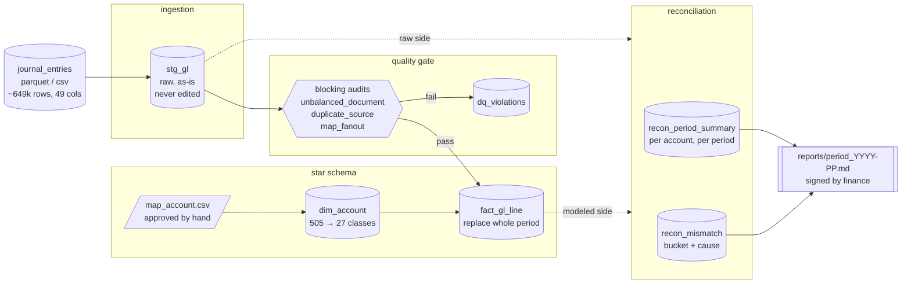

# Architecture

Layered left to right: where data enters, what shape it takes at each stage,
and where a number gets checked. Pattern names follow Bartosz Konieczny's
*Data Engineering Design Patterns* (O'Reilly, 2025).

Solid arrows are the data path. The dashed arrows into reconciliation are the
comparison: `stg_gl` (raw) against `fact_gl_line` (modeled), per period and
per account. Every difference is classified into `recon_mismatch` with one
bucket and one cause.

A rendered version of this diagram is at `docs/architecture.png`.

**Base layer (not drawn):** engine is DuckDB + Parquet; orchestration is
sequential Python scripts; the FY2025 P02 rows sit in `stg_gl` unreconciled
until their period is in scope.

## Pattern legend

Full definitions, with the book's problem statement and where we differ, are
in `docs/design-patterns.md`.

| Component | Pattern | Why here |
|---|---|---|
| `csv/parquet → stg_gl` | Full Loader | no CDC column, so a full EL copy |
| period replace, rerun-stable | Data Overwrite + Transactional Writer | delete and re-insert the whole period in one transaction |
| blocking audits before publish | Audit-Write-Audit-Publish | audits run before anything reaches `fact_gl_line` |
| non-blocking findings | Offline Observer | `local_amount_imbalance`, `unmapped_account` reported, not blocked |
| rejected rows | Dead-Letter | failed rows go to `dq_violations`, never dropped |
| duplicate grain | detector only, not Windowed Deduplicator | no version column exists, so block rather than auto-pick |
| `map_account` join | Static Joiner | enrichment from a small hand-owned file |
| period partitions | Horizontal Partitioner | the replace and backfill unit is one period |
| FY2025 P02 | Late Data Detector | out-of-scope rows stay visible, no merge |
| signed period report | Readiness Marker | downstream trusts a period only after sign-off |
| `recon_mismatch` bucket + cause | Fine-Grained Tracker | row-level trace from a changed row to the rule that changed it |

## Warehouse tables

One DuckDB file, `warehouse.duckdb` (gitignored, rebuilt by the loaders).
Flat table names in the default `main` schema; the prefix is the layer.

| Table | Layer | Built by |
|---|---|---|
| `stg_gl` | staging, raw | `src/load_stg.py` |
| `dim_account` | core | mapping build |
| `fact_gl_line` | core | period loader |
| `dq_violations` | quality, dead-letter | quality gate |
| `recon_period_summary` | reconciliation | account-level recon |
| `recon_mismatch` | reconciliation | document-level recon |

`map_account.csv` is a hand-approved file in the repo, not a warehouse
table.

## Scaling path

Same layers, swappable engines. The SQL and the contracts do not change.

- DuckDB to Databricks or Azure Synapse: engine swap, star schema identical
- Python scripts to an Airflow DAG: same jobs, adds retry, backfill, SLA
- local parquet to an ADLS or S3 landing zone: same Full Loader semantics
